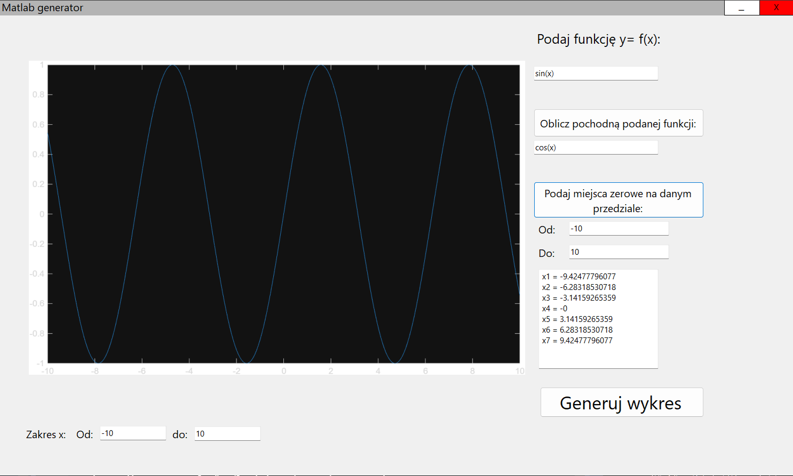

# MATLAB Desktop Interface 📉

Aplikacja desktopowa typu Windows Forms (C#), stanowiąca graficzny interfejs użytkownika (GUI) dla silnika obliczeniowego MATLAB. Projekt umożliwia wykonywanie zaawansowanych operacji matematycznych bez konieczności znajomości składni MATLABa.



## Funkcjonalności

Aplikacja integruje się z lokalnie zainstalowanym środowiskiem MATLAB, oferując następujące możliwości:

- **Generowanie wykresów:** Rysowanie wykresów funkcji jednej zmiennej w zadanym przedziale.
- **Obliczanie pochodnych:** Symboliczne wyznaczanie pochodnej funkcji ($f'(x)$).
- **Miejsca zerowe:** Numeryczne poszukiwanie miejsc zerowych w zadanym przedziale (algorytmy `fminbnd` oraz `fzero`).
- **Własny parser:** Wbudowany mechanizm walidacji wyrażeń matematycznych (sprawdzanie nawiasów, obsługa błędów, wykrywanie dzielenia przez zero).
- **Automatyczna wektoryzacja:** Użytkownik wpisuje `x^2`, a aplikacja tłumaczy to na składnię macierzową MATLABa `x.^2`.

## Technologie

* **Język:** C# (.NET Framework)
* **GUI:** Windows Forms (WinForms)
* **Silnik obliczeniowy:** MATLAB R2025b (Batch Mode)
* **Komunikacja:** `System.Diagnostics.Process` (Standard Input/Output redirection)
* **Inne:** Biblioteki `user32.dll` do obsługi niestandardowego wyglądu okna (frameless window).

## Wymagania i Konfiguracja

Aby uruchomić projekt, na komputerze muszą być zainstalowane:
1.  System operacyjny Windows (10/11).
2.  Środowisko **MATLAB** (kod domyślnie skonfigurowany pod wersję **R2025b**).

### Ważna uwaga przed uruchomieniem

W pliku `Form1.cs` ścieżka do pliku wykonywalnego MATLAB jest wpisana na sztywno ("hardcoded"). Przed uruchomieniem upewnij się, że posiadasz MATLAB w tej lokalizacji lub zmień ścieżkę w kodzie:

```csharp
// Znajdź tę linię w Form1.cs i dostosuj do swojej instalacji:
FileName = @"C:\Program Files\MATLAB\R2025b\bin\matlab.exe",
